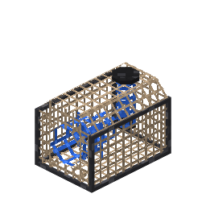

# Fish Trap

A Minecraft mod that adds an underwater trap which fishes on its own. Place it below the surface,
bait it, and it pulls in fish, junk and treasure based on the biome it sits in.

**[Wiki](https://fishtrap.coolerpromc.com)** · Minecraft 26.3 · Fabric and NeoForge · MIT

## Features

- **A trap that fishes without you.** Works only while fully submerged; every completed timer is a
  catch, and overflow drops into the water instead of stalling.
- **Six baits** that set both the timer and the luck applied to the roll, from Plant Bait to the
  Nautilus Lure.
- **Five net upgrades** that make the trap faster and luckier, add a chance at a second catch, and
  unlock catches cheaper nets cannot land. The trap's funnel changes colour to match the net.
- **Biome-specific catches** — separate tables for ocean, warm ocean, cold ocean, river, swamp and
  everywhere else.
- **Six new species** (trout, mackerel, catfish, crab, lobster, crayfish), all cookable, plus the
  **Rainbow Fish**: Absorption V and Resistance II when eaten.
- **Hopper friendly.** Pull catches from the bottom, push bait in from any other side.
- **13 advancements**, plus **JEI** and **Jade** integration when those mods are installed.

## Installing

1. Minecraft **26.3** with [Fabric](https://fabricmc.net/) (and Fabric API) or
   [NeoForge](https://neoforged.net/).
2. Drop the jar for your loader into `mods/`.
3. Optional: [JEI](https://modrinth.com/mod/jei) for catch chances in-game, and
   [Jade](https://modrinth.com/mod/jade) to see what a trap is doing by looking at it.

## Datapacks

Bait, nets and catch tables are datapack JSON — no config file, no code. `/reload` applies changes
immediately and the server syncs them to clients.

| Path | Defines |
| --- | --- |
| `data/<namespace>/bait/<name>.json` | item, min/max ticks, luck |
| `data/<namespace>/net/<name>.json` | item, style, speed multiplier, luck, bonus chance |
| `data/<namespace>/loot_table/fish_trap/<biome>.json` | a standard fishing loot table |

Field-by-field reference: [the datapack pages on the wiki](https://fishtrap.coolerpromc.com/datapacks/).

## Building

Requires JDK 25.

```bash
./gradlew build                 # jars for both loaders, under fabric/build/libs and neoforge/build/libs
./gradlew :fabric:runClient     # run the Fabric client
./gradlew :neoforge:runClient   # run the NeoForge client
./gradlew :neoforge:runData     # regenerate models, recipes, loot tables, tags, advancements and lang
```

Datagen is NeoForge-only and writes into `common/src/generated/resources`, which every loader
includes, so both jars ship identical generated data. Re-run it after changing any provider and
commit the output.

## Project layout

| Directory | Contents |
| --- | --- |
| `common/` | The mod. Block, block entity, menu, registries, datapack loaders, JEI and Jade compat. Compiled against vanilla, with no loader APIs. |
| `fabric/`, `neoforge/` | Loader entry points and the service implementations `common` calls through. |
| `neoforge/…/datagen/` | Every data provider; the source of truth for recipes, loot tables and advancements. |
| `common/src/generated/resources/` | Datagen output. Generated, but committed. |
| `docs/` | The VitePress wiki. See [docs/README.md](docs/README.md). |
| `blockbench/` | The Blockbench source for the trap model. |
| `build-logic/` | Shared Gradle conventions for the subprojects. |

The mod's own code lives in `common` wherever possible; loader-specific code goes behind the
`Services` interfaces rather than into the shared sources.

## Wiki

The site at [fishtrap.coolerpromc.com](https://fishtrap.coolerpromc.com) is built from `docs/` and
reads bait stats, catch tables, recipes, advancements and item textures out of the mod's own
datagen output, so it cannot drift from the game. Every push rebuilds and redeploys it through
GitHub Actions.

## License

[MIT](LICENSE). Built on the [MultiLoader Template](https://github.com/jaredlll08/MultiLoader-Template).
